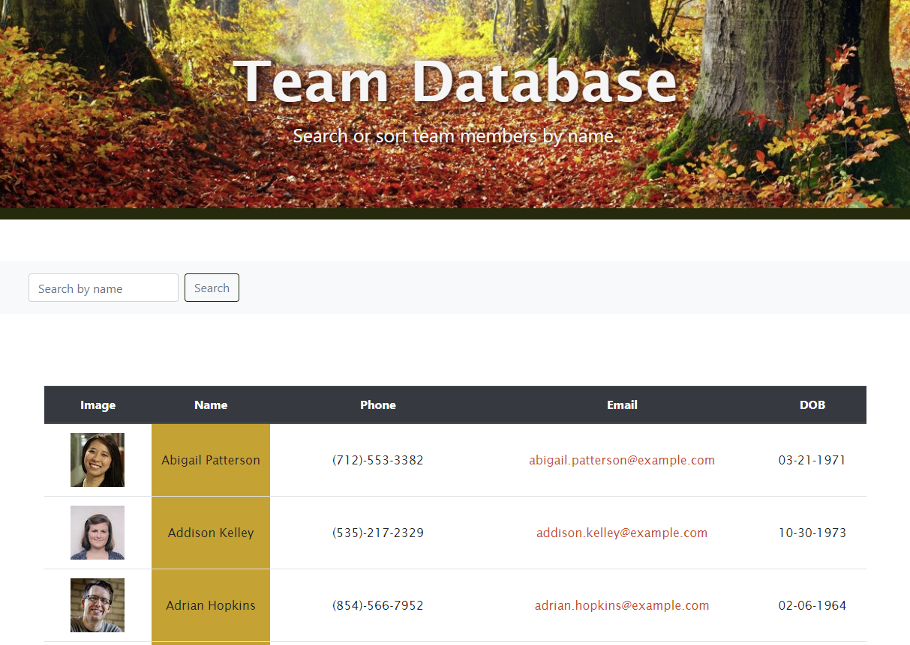

# Team Contacts
  

  ## Description
  A Database that allows you to search through your team and view their contact information.

  ## Deployed Site
  [Team Database](https://stacks-on-deck34.herokuapp.com/)
  

  ## Table of Contents
  
| [Installation](#installation) |
| [Use](#use) |
| [Contributors](#contributors) |
| [Test Instructions](#test-instructions) |
| [License Information](#license-information) |
    
  ## Installation
  Application is deployed through heroku otherwise the packages required to run this program are: react, axios, boostrap.
  
  ## Use
  Use react to search through a database that allows the user to view their team directory and have access to contact information as well as sort their employees by name.

  ## Contributors
- [Lindsey Bordner](https://github.com/LindseyM20)
- [Brooklynne Audette](https://github.com/B-Audette)
  
  ## Test Instructions
  n/a
  
  ## License Information
  This is licensed under the unlicense
